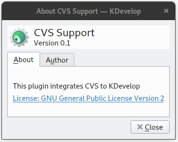

# kdevelop-cvs-plugin

  

This is a fork of the kdevelop discontinued cvs plugin.

I forked this because I work at a company that uses this plugin and I commited this plugin to my github in hopes that it will be useful to other developers.

## Compilation

`$ git clone https://github.com/Bacagine/kdevelop-cvs-plugin.git cvs`

`$ cd cvs`

`$ mkdir build`

`$ cd build`

`$ cmake ..`

`$ make`

## Instalation

After compile, you need copy the kdevcvs.so to the KDevelop plugins directory.

### For example:

#### In Slackware 15:

`# cp kdevcvs.so /usr/lib64/qt5/plugins/kdevplatform/35/`

#### In PureOS:

`# cp kdevcvs.so /usr/lib/x86_64-linux-gnu/qt5/plugins/kdevplatform/34/`
